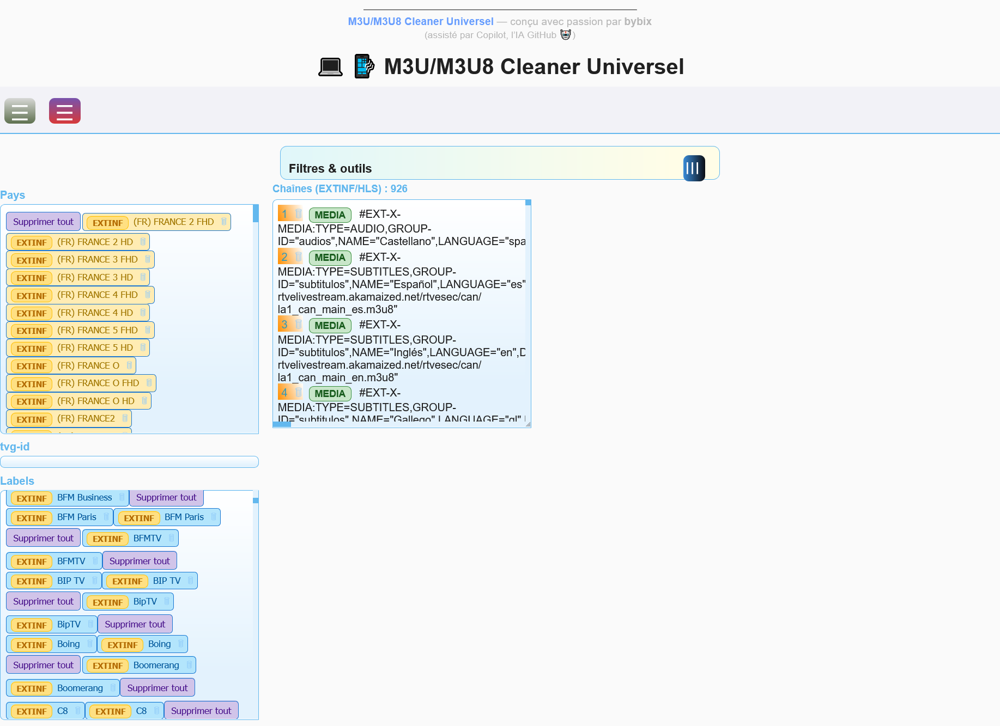

# M3U/M3U8 Cleaner Universel

## Présentation

Outil web moderne pour nettoyer, fusionner, filtrer et éditer des playlists **M3U/M3U8** (TV, radio, musique, etc.)  
- Interface responsive (PC/mobile)
- Mode sombre/clair/auto
- Gestion multi-fichiers, copier/coller
- Filtres avancés (pays, tvg-id, labels, mots-clés, recherche)
- Edition en ligne, suppression rapide, fusion, export
- Affichage adapté aux playlists **musique** (titre, durée, 🎵)
- Intégration facilitée d’un convertisseur YouTube → M3U/M3U8 (Tunemmusic, etc.)

---

## Fonctionnalités principales

- **Multi-fichiers** : importe, fusionne, nettoie plusieurs .m3u/.m3u8
- **Filtres puissants** : par pays, label, tvg-id, recherche globale, mots-clés à exclure
- **Copier/coller** : zone pour coller une playlist texte ou générer un fichier
- **Edition inline** : clique sur une ligne pour modifier EXTINF, URL, etc.
- **Suppression rapide** : par chaîne, par groupe, par mots-clés
- **Export** : sauvegarde ta playlist nettoyée en M3U
- **Thèmes** : sombre, clair, auto (suit le système)
- **Affichage musique** : détecte les titres/durées, pastille 🎵
- **Import YouTube** : champ conversion avec lien direct vers [Tunemymusic YouTube to M3U](https://www.tunemymusic.com/fr) ou autre site

---

## Mode d’emploi rapide

1. **Importer** un ou plusieurs fichiers (`Parcourir` ou glisser-déposer)
2. **Filtrer** par mots-clés, pays, label, etc.
3. **Modifier** à la volée les lignes (clic sur un titre ou une url)
4. **Supprimer** ce que tu veux (boutons “Supprimer tout” ou 🗑)
5. **Exporter** ta playlist nettoyée (`Fusionner`)
6. **Changer de thème** via le menu hamburger “Thème”

### Importer une playlist YouTube

- Colle l’URL d’une playlist YouTube dans le champ prévu, clique “Convertir”
- Un convertisseur externe (Tunemusic, etc.) s’ouvre
- Copie le M3U généré et colle-le dans la zone copier/coller de l’outil

---

## Astuce capture automatique (screenshot)

Tu peux automatiser la capture d’écran d’un site web avec :
- [shot-scraper (en CLI)](https://github.com/simonw/shot-scraper)
- [puppeteer](https://pptr.dev/) (Node.js)
- Outils comme [Screenity](https://chrome.google.com/webstore/detail/screenity-screen-recorder/), ou extensions Chrome “Full Page Screen Capture”

---

## Signature

---
> **M3U/M3U8 Cleaner Universel** — conçu avec passion par _bybix_  
> (assisté par GitHub Copilot 🤖)
---

## Licence

MIT.